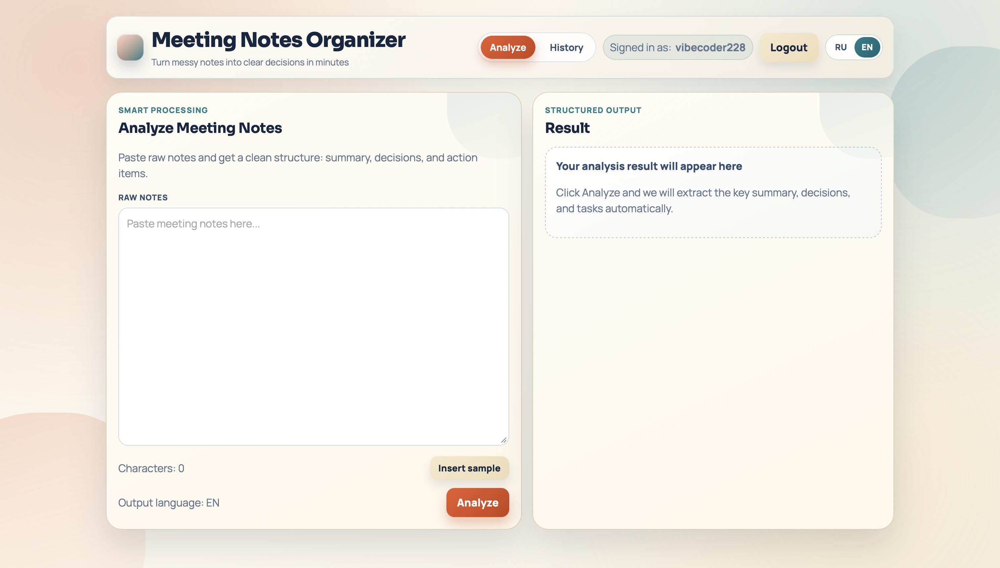
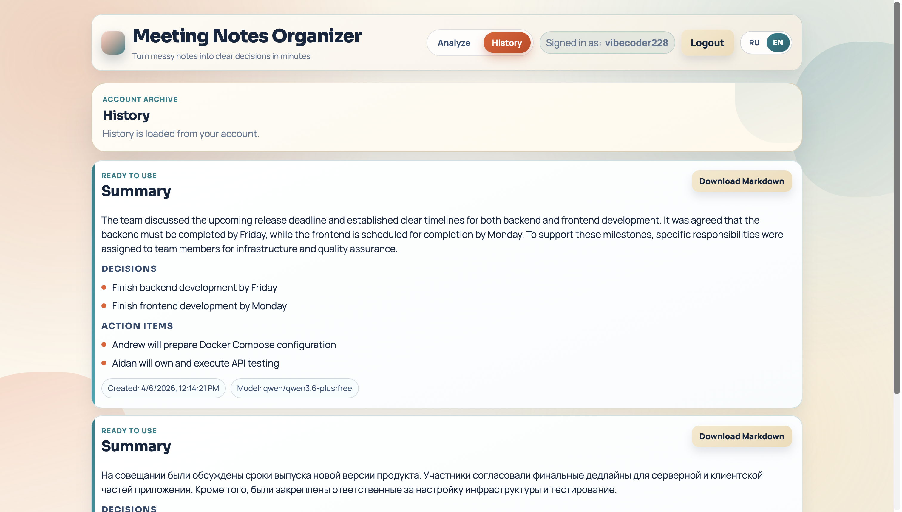

# Meeting Notes Organizer

Turn raw meeting notes into a clean summary, decisions, and actionable tasks in seconds.

Submission note: the GitHub repository for grading must be named `se-toolkit-hackathon`.

## Demo

Authorization screen:


Main analyze screen:



History screen:



## Product Context

### End users

- Students working on team assignments
- Small teams in startups
- Professionals who need quick meeting recap

### Problem that the product solves

Meeting notes are often messy and unstructured, so teams miss decisions and forget follow-up tasks.

### Solution

The app accepts raw notes, sends them to a Qwen-based free LLM API, returns structured output (summary, decisions, action items), and saves results to a user-specific history.

## Versioning (Lab 9)

### Version 1 (MVP)

- Input raw meeting notes
- Generate summary, decisions, and action items
- Store result in PostgreSQL

### Version 2

- User authentication (login/password)
- Personal history per user
- Markdown export
- Better UX (language switch RU/EN, improved error handling, stronger UI)
- Dockerized deployment for Ubuntu VM

### TA feedback addressed in Version 2

- Added persistent user-specific history
- Improved interface clarity and polish
- Added deployment-ready Docker Compose setup

## Features

### Implemented

- FastAPI backend with REST API
- PostgreSQL database with user and meeting note entities
- React frontend with analyze and history pages
- Auth: register/login/me with JWT
- User-isolated history and note access
- Free Qwen API integration with fallback models and retries
- Markdown export of analyzed notes
- RU/EN output language switch
- Dockerfiles for backend/frontend and Compose orchestration

### Not yet implemented

- PDF export
- Full-text search/filter in history
- CI pipeline with automated tests
- Custom domain + HTTPS reverse proxy setup

## Usage

1. Open the web app.
2. Register a new account or sign in.
3. Paste raw meeting notes on the Analyze page.
4. Click `Analyze` and wait for structured output.
5. Review previous analyses on the History page.
6. Export any result to Markdown if needed.

## Deployment

### VM OS

- Ubuntu 24.04 LTS

### What should be installed on the VM

- Git
- Docker Engine
- Docker Compose plugin

### Step-by-step deployment instructions

1. Clone the repository:

```bash
git clone <YOUR_REPO_URL>
cd se-toolkit-hackathon
```

2. Create environment file:

```bash
cp .env.example .env
```

3. Set required values in `.env`:

```bash
POSTGRES_DB=meeting_notes
POSTGRES_USER=postgres
POSTGRES_PASSWORD=postgres
DATABASE_URL=postgresql+psycopg://postgres:postgres@db:5432/meeting_notes

LLM_API_KEY=your_real_api_key
LLM_MODEL=qwen/qwen3-next-80b-a3b-instruct:free
LLM_FALLBACK_MODELS=qwen/qwen3.6-plus:free,qwen/qwen3-coder:free
LLM_RETRY_ATTEMPTS_PER_MODEL=2
LLM_RETRY_BACKOFF_SECONDS=1.5

JWT_SECRET=replace_with_long_random_secret
JWT_EXPIRE_MINUTES=720
```

4. Build and start all services:

```bash
docker compose up --build -d
```

5. Verify containers:

```bash
docker compose ps
```

6. Open product in browser:

- `http://<VM_IP>:5173`

7. Optional health check:

- `http://<VM_IP>:8000/api/v1/health`

8. Update deployment after changes:

```bash
git pull
docker compose up --build -d
```

## API Summary

- `POST /api/v1/auth/register`
- `POST /api/v1/auth/login`
- `GET /api/v1/auth/me`
- `POST /api/v1/notes/analyze`
- `GET /api/v1/notes?limit=20&offset=0`
- `GET /api/v1/notes/{id}`
- `GET /api/v1/notes/{id}/export/markdown`
- `GET /api/v1/health`

## Submission Helpers

- Slide template: `docs/submission/presentation_5_slides.md`
- Demo script: `docs/submission/demo_script_2min.md`
- Final checklist: `docs/submission/submission_checklist.md`
- Links and QR template: `docs/submission/links_template.md`
